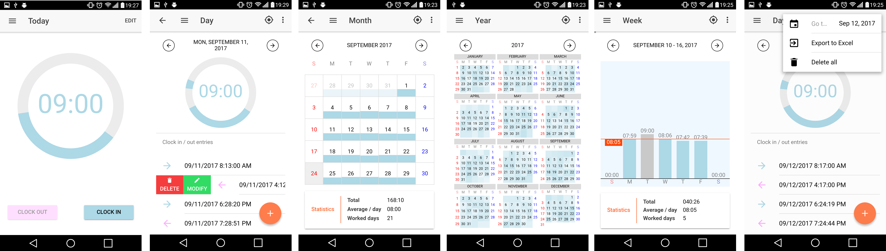

# Octagon Time Tracker
Octagon Time Tracker is a mobile application that helps you to keep track of your worked time. It is developed using Ionic Framework, and this is how it looks:

You can get it from [here](https://play.google.com/store/apps/details?id=com.sirarthurnell.octagon) if you want to install it on your phone or tablet.

## Usage
Simply clock in and out as you would do at your company, edit the entries you want to modify, review them with its year and month view, or even export them by sending an email with an Excel file attached to it.

## Characteristics
Apart from being divided into several pages, the application has two main components, the time gauge, which is done using SVG and the previous/next container, which provides the arrows and swipe gesture to navigate backward and forward.

The week view graph is written purely in CSS and Typescript. The time calculations and i18n is provided partly by the fabulous library [moment.js](http://momentjs.com) and partly by myself.

## Some experiences and thoughts
The application is a little bit slugglish in the year and month view when they are viewed from a phone. This is because the DOM operations that Angular templates produce are slow. Because there are many elements, the overall effect is sluggliness. There is very little that can be done, I profiled the application, I even replaced my actual calculations with a mere `for` loop that prints the day numbers from 1 to 365 and it still shows sluggliness. Of course, it doesn't happen with the application is executed from a desktop environment.

I used jQuery to develop the previous/next component, and I did it simply because jQuery is, not only more comfortable to work with than plain vanilla JS, but because it is highly optimized, much faster than Angular templates. It seems there is a trend against using jQuery when it comes to develop applications with Angular, with the pretext of portability. **I don't believe in that**, and I think it is kind of absurd to talk about portability when everyone knows almost perfectly if the application being developed with end up running on Angular Native, even more, when what the objects that reside on the layer below the `nativeElement` have properties that don't match the ones that the DOM objects have. It makes no sense to make oneself's life harder.

Apart from all the above, I have found notable difficulties using Ionic because of their stale documentation. I have lost many hours just because of that, and because the paradigm Angular follows shows some friction when it is brought to the mobile development world. If I had known all that before, I would have gone native without doubt.

That's all. I hope it helps.
